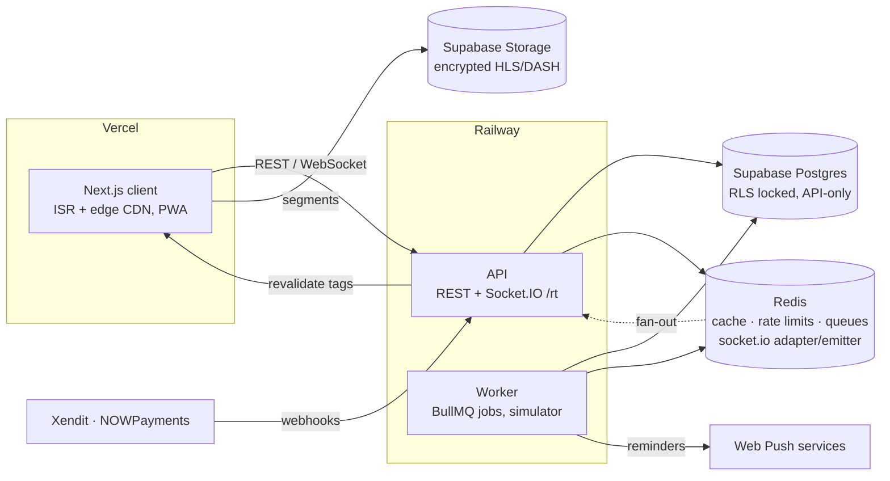

# thumbz-server

API and background worker for **THUMBZ**, a Mobile Legends esports companion:
live matches with realtime stats, replays with DRM, venue tickets paid by
QRIS / bank virtual account / crypto, search, and match reminders.

NestJS 11 · Prisma 6 on Supabase Postgres · Redis (cache, rate limits,
queues, realtime fan-out) · BullMQ · Socket.IO · Docker.

The frontend lives in [`thumbz-next-client`](../thumbz-next-client). The
boundary between them is [`docs/API-CONTRACT.md`](docs/API-CONTRACT.md) plus the
generated [`openapi.json`](openapi.json) (`/docs` serves Swagger UI).

## Architecture



## Engineering highlights

| Area | What | Where | Why |
| --- | --- | --- | --- |
| Realtime | Socket.IO rooms, per-room `seq` + REST resync, Redis adapter/emitter, presence | `src/modules/realtime/` | [ADR 0001](docs/adr/0001-realtime-over-socket-io.md) |
| Pagination | Opaque keyset cursors (stable ties), capped offsets, `before`/`after` comment cursors | `src/common/utils/cursor.ts` | [ADR 0002](docs/adr/0002-keyset-and-offset-pagination.md) |
| Search | `pg_trgm` + `tsvector`, typo-tolerant (`onik` → ONIC), cached suggestions | `src/modules/search/` | |
| Caching | Cache-aside, single flight + Redis lock, jittered TTL, tag invalidation, ETag/304, CDN headers, frontend revalidation | `src/infra/cache/`, `src/infra/revalidation/` | [ADR 0005](docs/adr/0005-redis-cache-aside-with-tags.md) |
| Payments | One provider interface (Xendit QRIS/VA, NOWPayments, sandbox), inbox dedupe, row locks, pure state machine, amount checks, idempotency keys, signed ticket QR | `src/modules/payments/`, `src/common/idempotency/` | [ADR 0003](docs/adr/0003-payments-behind-one-provider-interface.md) |
| DRM | ClearKey license server, HLS AES-128 key proxy, sealed keys, 2-device limit, commercial CDM passthrough, packaging pipeline | `src/modules/media/`, `scripts/media/` | [ADR 0004](docs/adr/0004-hybrid-drm.md) |
| Jobs | Separate worker, idempotent schedulers: hold expiry, reconciliation, reminders, simulator | `src/worker.ts`, `src/modules/jobs/` | [ADR 0006](docs/adr/0006-separate-worker-process.md) |
| Series model | Games as data, score derived, per-game statistics, builds and item sequence | `src/modules/matches/`, `src/modules/admin/` | [ADR 0007](docs/adr/0007-series-games-as-data.md) |
| Real data | One week of MPL PH S18 imported politely (robots.txt, cache, pauses), parsed and tested; live matches replay the recorded games in real time and loop | `scripts/data/mpl-ph/`, `src/modules/simulator/` | [ADR 0008](docs/adr/0008-demo-replays-real-recorded-games.md) |
| Web Push | VAPID, per-device subscriptions, deduped reminders, dead-endpoint cleanup | `src/modules/push/` | |
| Operations | zod-validated env (fails fast), pino JSON logs + request ids, Prometheus `/metrics`, `/health/live` + `/health/ready`, graceful shutdown | `src/config/`, `src/infra/` | |
| Safety | Test runs refuse non-local databases, RLS deny-by-default, write rate limits per user/IP, error envelope that never leaks internals | `src/prisma/test-database-guard.ts`, `src/common/` | |

## Quick start (local)

Requirements: Node (see `.nvmrc`), Docker.

```bash
cp .env.example .env              # local values; never put cloud credentials here for tests
npm ci
docker compose up -d postgres redis   # Postgres on 44322, Redis on 6379
npx prisma migrate deploy
npx prisma db seed                    # MPL PH S18 week 8: replays, live, upcoming (local DB only)
npm run start:dev                     # API on :3001  (Swagger: /docs)
npm run start:worker:dev              # jobs; LIVE_SIMULATOR=true replays the live matches
```

Using the full Supabase stack instead (`supabase start`) also gives you Auth and
Storage locally; point `DATABASE_URL` at `127.0.0.1:44322` and
`SUPABASE_JWKS_URL` at `http://127.0.0.1:44321/auth/v1/.well-known/jwks.json`
(plain http is accepted only for localhost in development).

Optional features switch on by env (all documented in `.env.example`):
Xendit / NOWPayments keys, `PAYMENTS_SANDBOX` (demo checkout), DRM keys,
VAPID keys (Web Push), `LIVE_SIMULATOR`.

### Protected replay (optional)

```bash
FFMPEG=ffmpeg PACKAGER=packager npm run media:package -- demo   # synthetic clip unless a source is given
SUPABASE_URL=… SUPABASE_SERVICE_ROLE_KEY=… DRM_MASTER_KEY=… DATABASE_URL=… \
  npm run media:register -- media-out/demo --video <video-id>
```

## Testing

| Suite | Command | Notes |
| --- | --- | --- |
| Lint + types | `npm run lint:check && npm run typecheck` | |
| Unit / integration | `npm run test:cov` | 298 tests; coverage floor in `package.json` |
| End to end (HTTP + Socket.IO) | `npm run test:e2e -- --coverage` | 191 tests against real Postgres/Redis (incl. the live replay loop on a faked clock); 83 % line coverage of `src/`, floor in `test/jest-e2e.json` |
| Load | see [`load/README.md`](load/README.md) | k6 read paths: 2,012 req/s, p95 88 ms · 2,000 sockets: 100 % reach, p95 45 ms |

Tests only run against a local database: `test/setup-env.ts` loads
`.env.test`, and the Prisma client refuses any non-local host while
`NODE_ENV=test`.

CI (`.github/workflows/ci.yml`) runs lint, types, build, an OpenAPI drift
check, migrations + seed, both suites with coverage floors, and a Docker image
build. `load.yml` runs the load tests against a staging URL on demand.

## Database notes

- Migrations live in `prisma/migrations/`; every business table has Row Level
  Security enabled with no grants to `anon`/`authenticated`. Only the API
  (service role) reads them and enforces auth itself.
- Supabase in production: use the **session pooler** URI with
  `?pgbouncer=true&connection_limit=4`. The direct host is IPv6-only on new
  projects, and the transaction pooler (`:6543`) breaks Prisma migrations.
  Don't keep the `[...]` around the password from the dashboard.
- `npx prisma db seed` replaces all catalog data (tournaments, teams, players,
  matches, videos) with the dataset in `prisma/data/`, keeps user accounts and
  re-links a registered protected replay. It refuses a non-local database
  unless `SEED_REMOTE=replace-catalog` is set.

## Demo data

Real match data of **MPL Philippines Season 18, week 8** (ph-mpl.com):
rosters, heroes, K/D/A, gold, damage, builds, emblems, talents and the item
purchase sequence of every game. Names of items, emblems and talents come from
MLBB Academy reference data. Dates are shifted around "now": the first day's
matches are yesterday's replays, the middle day's are live (the worker replays
the recorded games, looping), the last day's are upcoming with tickets.

```bash
npm run data:fetch -- --week 8   # polite: robots.txt paths only, cached in data-cache/
npm run data:build -- --week 8   # → prisma/data/*.json + catalog-review.csv
```

Match data © Moonton / MPL Philippines, used for a non-commercial portfolio.

## Deployment

Railway, from the `Dockerfile` (`railway.json` runs `prisma migrate deploy`
before each release):

- **api** — default start command, health check `/health`.
- **worker** — same image, start command `node dist/worker.js`, no public port.
- A Redis plugin shared by both.

Required production variables are validated at boot; see
`.env.production.example`.
